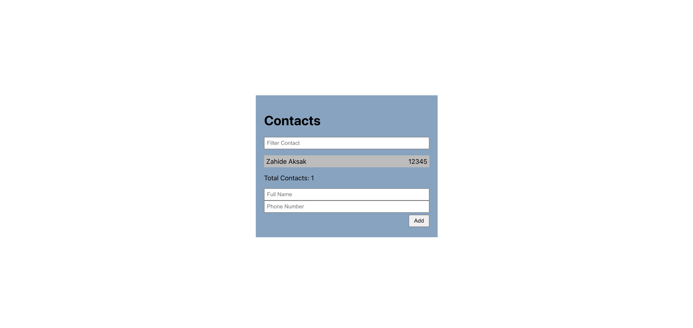

# Contacts App

This project is a React application that allows users to manage their contacts. It provides a user-friendly interface for adding, filtering, and viewing contacts.



## Features

- Add new contacts with full name and phone number.
- Filter contacts by name or phone number.
- View the total number of contacts.

## Installation

1. Clone the repository:

   ```bash
   git clone https://github.com/your-username/contacts-app.git
   ```

2. Change to the project directory:

   ```bash
   cd contacts-app
   ```

3. Install dependencies:
   ```bash
   npm install
   ```

## Usage

1. Start the development server:

```bash
npm start
```

2. Open your browser and visit http://localhost:3000.

3. Use the application to manage your contacts.
